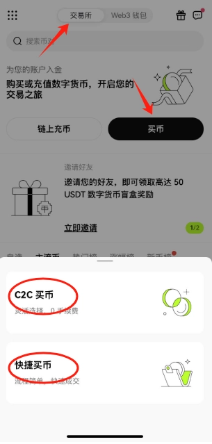
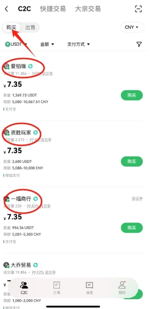
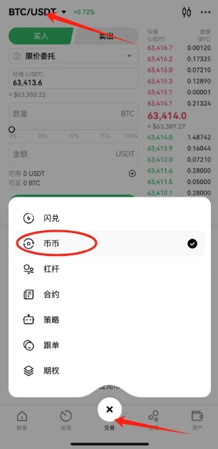

# How to Use OKX Exchange and Buy Bitcoin (BTC)

You've probably seen news stories about people making fortunes overnight trading crypto, or losing everything in a catastrophic liquidation. But most folks have no clue what this whole thing actually is, or where you'd even buy Bitcoin if you wanted to. This guide breaks down exactly how to purchase cryptocurrency—Bitcoin and other digital assets—in plain English.

---

To buy crypto, you need an exchange platform. The most popular ones are OKX and Binance. Think of them like stock brokerages—the Schwab or Fidelity of the crypto world. These exchanges operate on "coin-to-coin" trading, meaning you can't just throw your regular money (like USD or RMB) directly at Bitcoin. Instead, you first buy USDT with your cash.

USDT (Tether) is what's called a stablecoin—a cryptocurrency pegged 1:1 to the US dollar. One USDT should always equal one dollar. Because its value stays stable, traders use it as their "cash equivalent" in the crypto market. Most exchanges offer trading pairs based on USDT, letting you swap it for Bitcoin or whatever else you're after. It's basically your spending money in the crypto world.

This guide focuses on OKX, with screenshots and step-by-step instructions. The logic is identical on Binance—just a different interface. We'll cover buying and selling USDT, then using that USDT to purchase Bitcoin.

## Downloading and Registering for OKX or Binance

First things first: register and verify your identity. Important note—you'll need a VPN because these platforms aren't accessible in certain regions. Also, Hong Kong and Singapore nodes won't work either, as those regions have restrictions too.

👉 [Start trading on OKX with exclusive 20% fee discount—click here to register](https://www.okx.com/join/47044926)

Use invitation code **47044926** when signing up to unlock a permanent 20% trading fee discount. Skip this step and you'll be paying significantly more in fees down the road. This discount only applies when you register through the referral link.

## Buying and Selling USDT

Below are screenshots from the OKX app showing the straightforward process:

**(1)** Tap "Trade," then "Buy Crypto." You'll see two options: C2C Trading or Quick Buy.

**a) Quick Buy** – The system automatically matches you with the best-priced merchant.  
**b) C2C Trading** – You manually select from individual merchants. Don't chase rock-bottom prices here—suspiciously cheap USDT could be "dirty coins" that trigger bank account freezes. Look for merchants with long registration histories and high transaction volumes.

**(2)** Enter the purchase screen, tap "Buy," and manually select a merchant. You can pay via Alipay or WeChat for whatever amount of USDT you need.

If you need to sell USDT later, just tap the "Sell" tab at the top. Same warning applies—don't get greedy with high prices, or you might receive dirty money.

## Using USDT to Buy Bitcoin

On OKX, you need to transfer funds first. Go to your Assets page and move USDT from your Funding Account to your Trading Account.

**(1)** Tap "Trade" at the bottom, then "Spot Trading." In the upper left, select BTC/USDT. This screen is where you're trading USDT for Bitcoin—works just like buying stocks. Once you buy, the Bitcoin sits in your account. Want to sell later? Same process, just hit the sell button to convert your Bitcoin back to USDT.

Fair warning: stay away from leverage and futures trading. That path almost always ends in liquidation and total loss. It's straight-up gambling.

---

## Wrapping Up

That covers the basic trading operations for cryptocurrency on the OKX exchange. As you can see, it's actually pretty straightforward—nothing mysterious about it. 👉 [OKX offers one of the most user-friendly platforms for beginners looking to enter the crypto market](https://www.okx.com/join/47044926), with lower fees and better merchant protection compared to many alternatives. Feel free to explore the other features on your own—the interface is intuitive once you get the hang of it.
